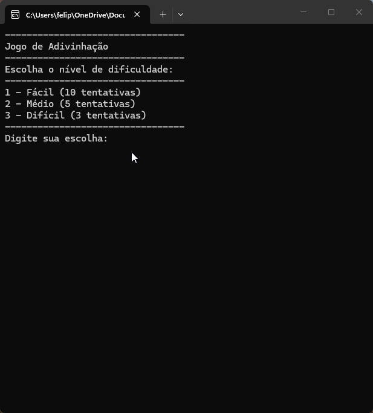

# Jogo de Adivinhação #



## Projeto

Um jogo de adivinhação numérica desenvolvivo durante a segunda atividade no curso de desenvolvimento em C# na [Academia do Programador](https://www.academiadoprogramador.net).

## Introdução

Um jogo que roda em console, onde o usuário escolherá uma dificuldade e baseada na escolha, o jogador deverá acertar o número gerado aleatoriamente em determinados números de tentativas.

## Funcionalidades

O jogador terá um menu inicial onde poderá escolher a dificuldade do jogo. Escolhendo o nível fácil terá 10 tentativas para acertar um número gerado aleatoriamente entre 1 e 20. No nível médio terá 5 tentativas para acertar um número entre 1 e 50, e no nível difícil (quase impossível) terá 3 tentativas para acertar um número entre 1 e 100. 

## Pontuação

O jogo conta com um sistema de pontuação, onde o jogador começa com 1000 pontos e a cada erro, dependendo da diferença numérica entre o número chutado e o número que precisa ser adivinhado, a pontuação do jogador vai diminuindo, podendo perder 100, 50 ou vinte pontos a cada tentativa.

## Como abrir o jogo

1. Clone ou baixe os arquivos do repositório.
2. Abra o seu emulador de terminal de preferência e navegue até a pasta raiz do projeto baixado.
3. Utilize o comando abaixo para restaurar as dependências do projeto.

    ```
    dotnet restore
    ```
4. Em seguida compile e execute o projeto com o comando:

    ```
    dotnet run --project JogoDeAdivinhacao.ConsoleApp
    ```
## Requisitos ##

- .NET 10.0 SDK